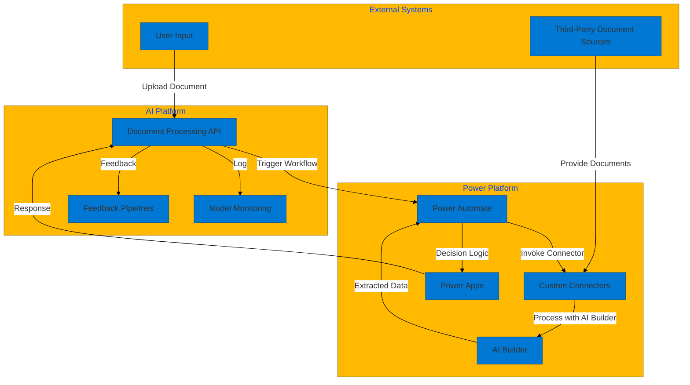

# High-Level Technical Architecture: Document Processing with Power Platform

## Architecture Diagram
The following Mermaid diagram illustrates the integration of document processing workflows with Power Automate, connectors, and other Power Platform features:

## Key Components
1. **Document Processing API**: Serves as the entry point for document uploads and workflow triggers.
2. **Power Automate**: Orchestrates the workflow, triggering connectors and AI Builder processes.
3. **Custom Connectors**: Facilitates integration with external systems and APIs.
4. **AI Builder**: Processes documents for data extraction and analysis.
5. **Power Apps**: Provides a user interface for decision-making and workflow interaction.
6. **Model Monitoring**: Tracks the performance of document processing models.
7. **Feedback Pipelines**: Collects user feedback and system metrics for iterative improvements.

## Benefits
- **Streamlined Workflows**: Automates document processing with Power Platform features.
- **Extensibility**: Custom connectors enable integration with diverse systems.
- **User-Friendly Interfaces**: Power Apps simplifies interaction with workflows.
- **Continuous Optimization**: Monitoring and feedback ensure ongoing improvements.

