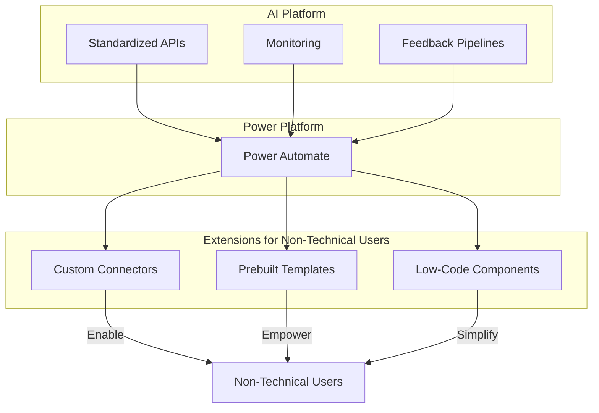

# High-Level Technical Architecture

The following diagram illustrates the integration of our AI platform with Power Platform to enable non-technical users to build AI-driven solutions while leveraging our existing infrastructure.

### Key Components
- **AI Platform**: Provides the core infrastructure, including standardized APIs, monitoring, and feedback pipelines.
- **Power Platform**: Enables integration through tools like Power Automate.
- **Extensions**: Offers custom connectors, prebuilt templates, and low-code components to empower non-technical users.
- **Non-Technical Users**: Build AI-driven solutions without requiring deep coding skills.

