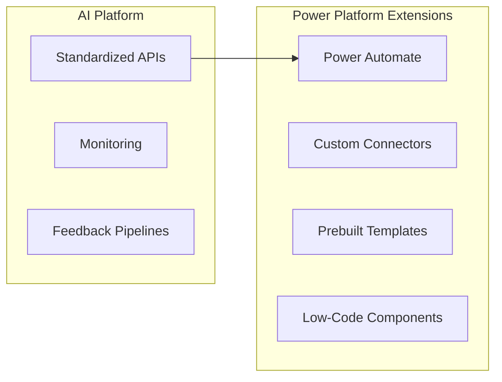

# High-Level Technical Architecture

The following diagram illustrates the integration of our AI platform with Power Platform to enable users to build AI-driven solutions while leveraging our existing infrastructure.

### Key Components
- **AI Platform**: Provides the core infrastructure, including standardized APIs, monitoring, and feedback pipelines.
- **Power Platform & Extensions**: Combines tools like Power Automate with custom connectors, prebuilt templates, and low-code components to empower users.

