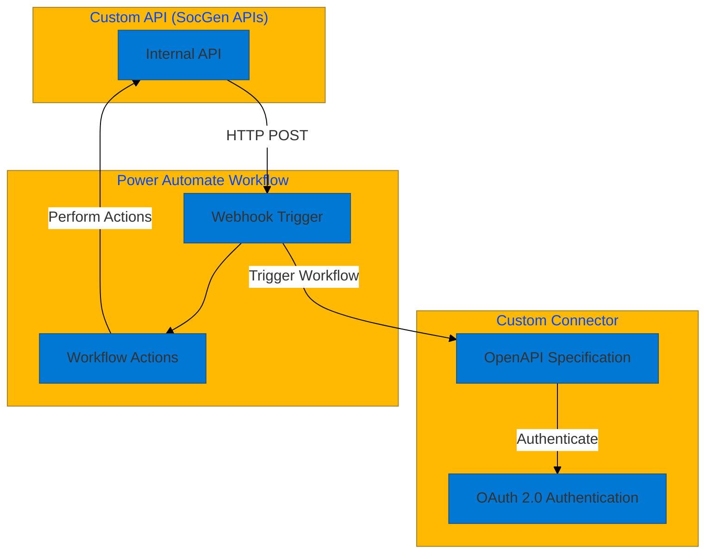

# High-Level Technical Architecture: Custom API and Power Automate Integration

## Architecture Diagram
The following Mermaid diagram illustrates the integration of custom APIs, custom connectors, and Power Automate workflows:

## Key Components
1. **Custom API (SocGen APIs)**:
   - Internal APIs that trigger workflows by making HTTP POST requests to Power Automate webhook endpoints.

2. **Custom Connector**:
   - Built using OpenAPI specifications.
   - Secured with OAuth 2.0 authentication.

3. **Power Automate Workflow**:
   - Starts with a webhook trigger when an internal API sends a request.
   - Executes workflow actions such as data processing, notifications, or API calls.

## Benefits
- **Seamless Integration**: Connects internal APIs with Power Automate workflows using custom connectors.
- **Automation**: Enables automated workflows triggered by API calls.
- **Security**: Ensures secure communication with OAuth 2.0 authentication.

