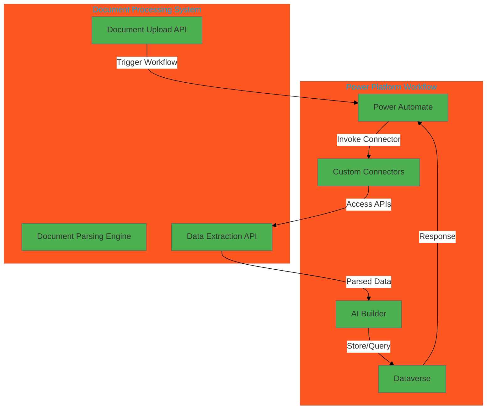

# High-Level Technical Architecture: Document Processing Integration with Power Platform

## Architecture Diagram
The following Mermaid diagram illustrates the integration of a document processing system with Power Platform no-code workflows:

## Key Components
1. **Document Processing System**:
   - **Document Upload API**: Accepts documents for processing.
   - **Document Parsing Engine**: Processes and parses uploaded documents.
   - **Data Extraction API**: Provides structured data extracted from documents.

2. **Power Platform Workflow**:
   - **Power Automate**: Orchestrates the workflow, triggering actions based on document uploads.
   - **Custom Connectors**: Facilitates secure communication between Power Platform and the document processing system.
   - **AI Builder**: Enhances workflows with AI capabilities for document analysis.
   - **Dataverse**: Stores and queries processed data for further use.

## Benefits
- **Automation**: Streamlines document processing with no-code workflows.
- **Scalability**: Easily integrates with APIs.
- **Flexibility**: Supports advanced AI capabilities and data storage through Power Platform.

