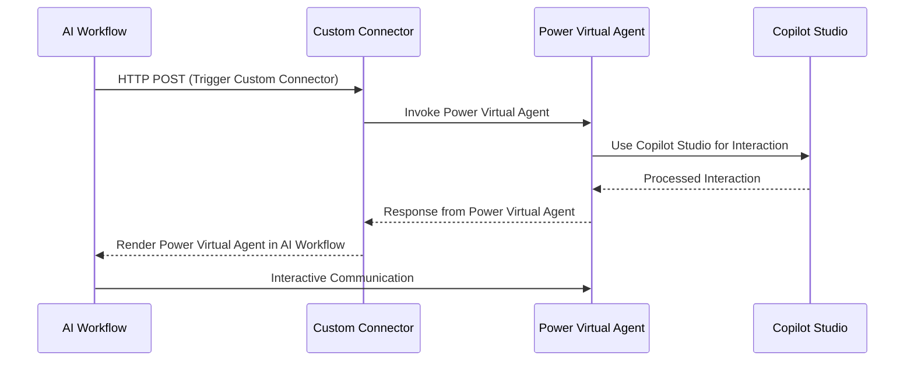

# Sequence Diagram: AI Workflow and Power Virtual Agent integration via Power Platform

## Description
1. **AI Workflow**:
   - Initiates the process by making an HTTP POST request to the custom connector.
   - Renders the Power Virtual Agent for interactive communication.

2. **Custom Connector**:
   - Acts as a bridge, invoking the Power Virtual Agent.

3. **Power Virtual Agent**:
   - Handles user interactions and processes requests using Copilot Studio.

4. **Copilot Studio**:
   - Provides advanced interaction capabilities for the Power Virtual Agent.

5. **Response Handling**:
   - The response from the Power Virtual Agent is sent back to the custom connector and rendered in the AI workflow for interactive use.

