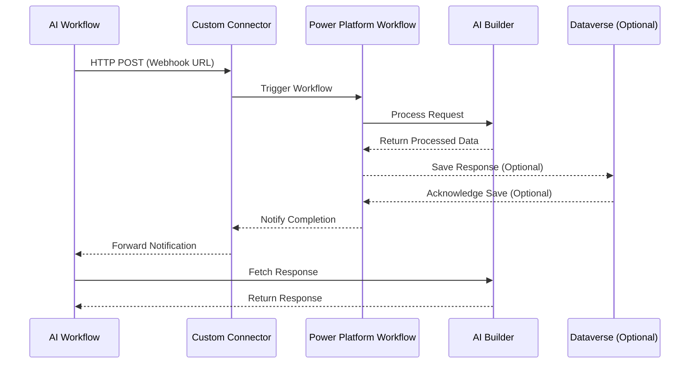

# Sequence Diagram: AI Workflow and Power Automate workflow integration via Power Platform

## Description
1. **AI Workflow**:
   - Initiates the process by making an HTTP POST request to the custom connector's webhook URL.
   - Fetches the response directly from the AI Builder based on the notification from the custom connector.

2. **Custom Connector**:
   - Acts as a bridge, triggering the Power Platform workflow upon receiving the HTTP POST request.
   - Forwards the notification of completion to the AI workflow.

3. **Power Platform Workflow**:
   - Executes the defined workflow actions.
   - Sends the request to AI Builder for processing.
   - Optionally saves the processed response in Dataverse.
   - Notifies the custom connector upon completion.

4. **AI Builder**:
   - Processes the request and returns the processed data to the Power Platform workflow.
   - Provides the response directly to the AI workflow upon request.

5. **Dataverse (Optional)**:
   - Stores the workflow response if required.

6. **Response Handling**:
   - The workflow completion notification is sent back to the custom connector, which forwards it to the AI workflow.
   - The AI workflow fetches the response directly from the AI Builder.

