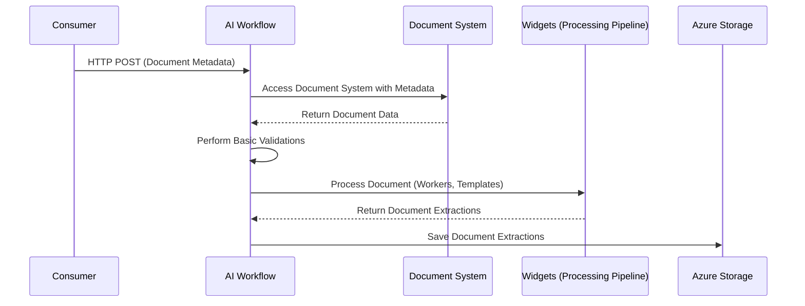
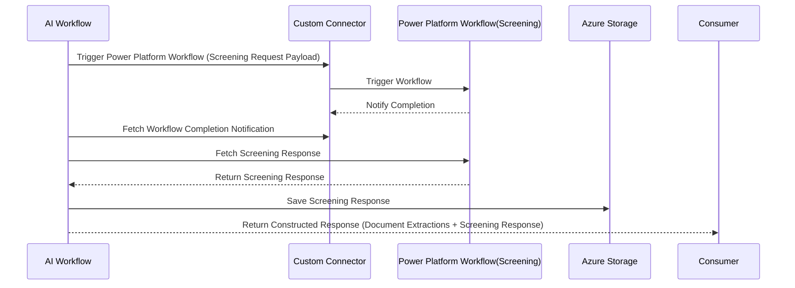

# Sequence Diagram: AI Workflow and Power Automate workflow integration via Power Platform

## Part 1: AI Workflow and Document Processing

## Part 2: Power Platform Workflow Integration

## Description
1. **Consumer**:
   - Sends an HTTP POST request to the AI Workflow with document metadata.

2. **AI Workflow**:
   - Accesses the Document System using the provided metadata.
   - Performs basic validations on the document data.
   - Processes the document using widgets (Workers, Templates).
   - Saves the document extractions to Azure Storage.
   - Calls the custom connector to trigger the Power Platform workflow with the screening request payload.
   - Fetches the workflow completion notification and screening response from the Power Platform workflow.
   - Saves the screening response to Azure Storage.
   - Constructs and sends the final response (document extractions + screening response) to the Consumer.

3. **Document System**:
   - Provides document data based on the metadata.

4. **Widgets (Document Processing Pipeline)**:
   - Processes the document using various tools like Workers, and Templates.

5. **Azure Storage**:
   - Stores document extractions and screening responses.

6. **Custom Connector**:
   - Acts as an intermediary to trigger the Power Platform workflow and notify AI Workflow upon completion.

7. **Power Platform Workflow**:
   - Processes the screening request and returns the screening response.

8. **Security and Optimization**:
   - All communication is secured using HTTPS and token-based authentication.
   - Input data is validated and sanitized before processing.
   - Errors are logged and handled gracefully to ensure reliability.

