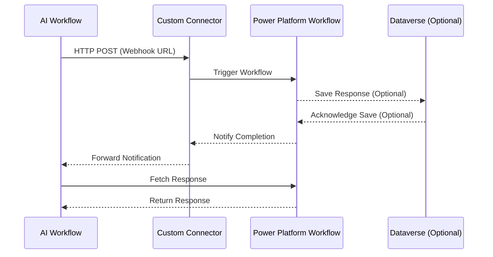

# Sequence Diagram: AI Workflow and Power Automate workflow integration via Power Platform

## Description
1. **AI Workflow**:
   - Sends an HTTP POST request to the custom connector's webhook URL with the required data payload.
   - Receives the workflow completion notification from the custom connector.
   - Fetches the response from the Power Platform workflow and processes it.

2. **Custom Connector**:
   - Acts as an intermediary, routing the request to the Power Automate flow.
   - Uses secure authentication (e.g., OAuth 2.0) to validate requests and access the Power Automate environment.
   - Forwards the workflow completion notification to the AI workflow.

3. **Power Platform Workflow**:
   - Processes the input data received from the custom connector.
   - Optionally saves the processed response in Dataverse.
   - Notifies the custom connector upon workflow completion.
   - Returns the processed response to the AI workflow upon request.

4. **Dataverse (Optional)**:
   - Stores the workflow response if required.

5. **Security and Optimization**:
   - All communication is secured using HTTPS and token-based authentication.
   - Input data is validated and sanitized before processing.
   - Errors are logged and handled gracefully to ensure reliability.

