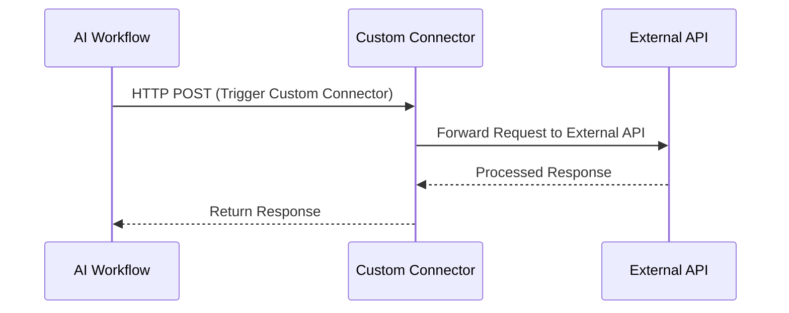

# Sequence Diagram: AI Workflow and External API integration via Power Platform

## Description
1. **AI Workflow**:
   - Initiates the process by making an HTTP POST request to the custom connector.

2. **Custom Connector**:
   - Acts as a bridge, forwarding the request to the external API and receiving the processed response.

3. **External API**:
   - Processes the request and sends the response back to the custom connector.

4. **Response Handling**:
   - The custom connector sends the response back to the AI workflow.

