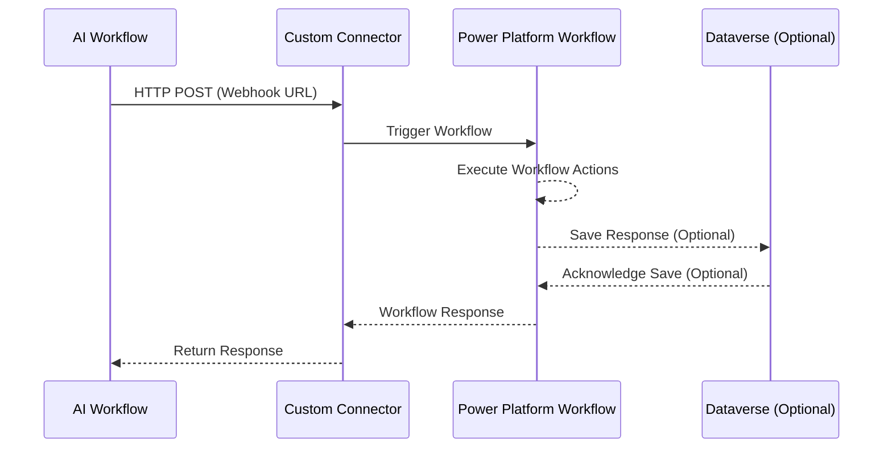

# Sequence Diagram: AI Workflow and Power Automate workflow integration via Power Platform

## Description
1. **AI Workflow**:
   - Initiates the process by making an HTTP POST request to the custom connector's webhook URL.

2. **Custom Connector**:
   - Acts as a bridge, triggering the Power Platform workflow upon receiving the HTTP POST request.

3. **Power Platform Workflow**:
   - Executes the defined workflow actions.
   - Optionally saves the response in Dataverse.

4. **Dataverse (Optional)**:
   - Stores the workflow response if required.

5. **Response Handling**:
   - The workflow response is sent back to the custom connector, which forwards it to the AI workflow.

